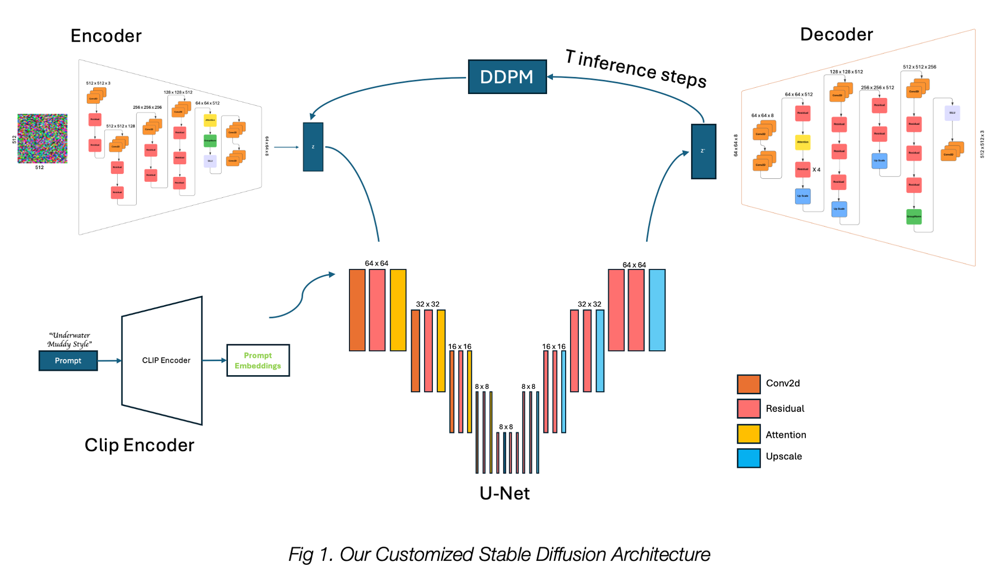
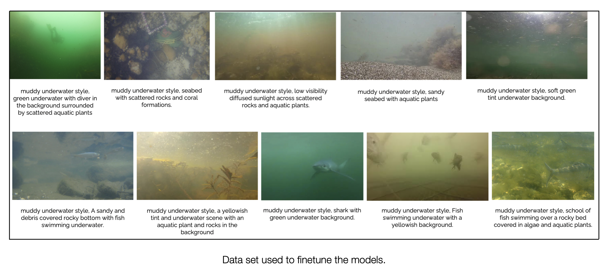
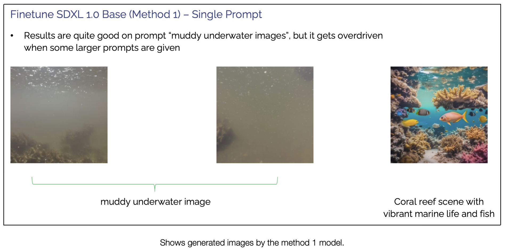
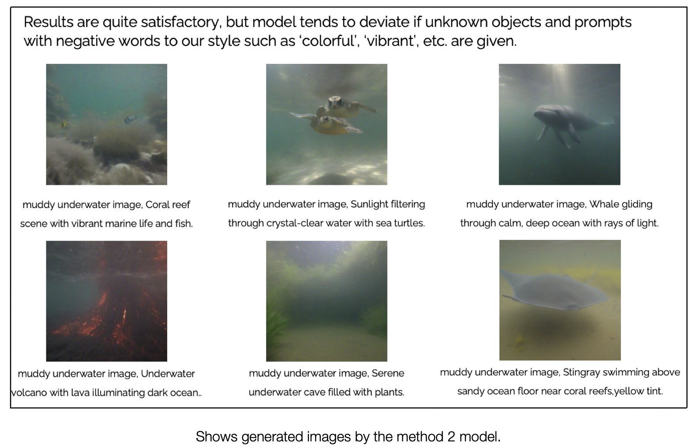
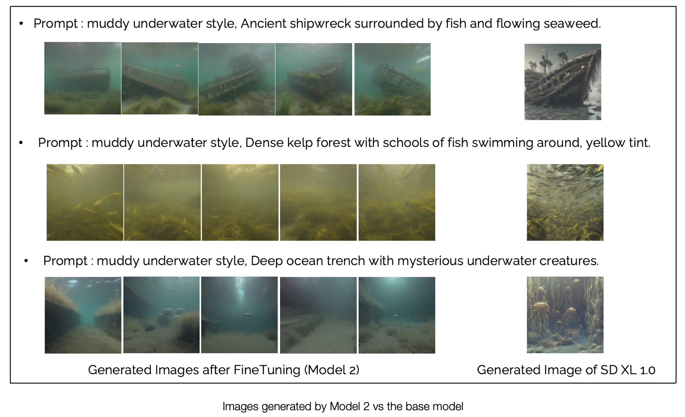
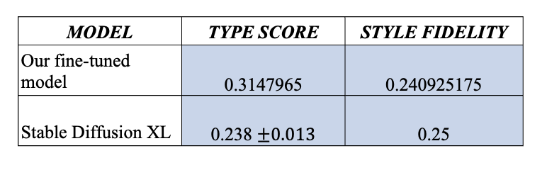

## Underwater Muddy Image Generation using fine-tuned StableDiffusionXL model

- The simulation of underwater environments with high turbidity is crucial for developing and testing image processing and computer vision algorithms. However, obtaining real-world muddy underwater images can be challenging due to logistical and environmental constraints. In this work, we present a novel method for generating synthetic muddy underwater images using a fine-tuned Stable Diffusion XL (SDXL) model. By training SDXL on a dataset of underwater scenes with varying levels of murkiness and particle density, we produce realistic images that emulate the challenging conditions of underwater environments with limited visibility. This synthetic dataset provides a valuable resource for researchers developing and testing algorithms for underwater exploration, navigation, and analysis under adverse visibility conditions.
##
# Section 1
### About the project
- Underwater image analysis plays a critical role in fields such as marine biology, underwater navigation, archaeology, and environmental monitoring. 
- However, in environments with high levels of suspended particles, as in murky or muddy waters, underwater images suffer from poor visibility and low contrast. 
- These challenging conditions hinder the performance of computer vision and machine learning models in accurately interpreting underwater scenes. 
- Obtaining real-world data in such conditions is often limited by accessibility, cost, and environmental impact, making it difficult to collect diverse datasets that represent the full spectrum of underwater turbidity and visibility challenges.
- In response to these limitations, we explore synthetic data generation as a viable alternative for creating muddy underwater images using the Stable Diffusion XL (SDXL) model. SDXL, a cutting-edge text-to-image model, is well-regarded for its ability to generate complex, photorealistic images across various domains. 
- By fine-tuning this model with examples of underwater scenes exhibiting varying turbidity levels, we can simulate diverse muddy environments. These synthetic images closely resemble real-world conditions, providing researchers and engineers with a readily available dataset that can be customized to suit specific visibility challenges.
- This work details our methodology for fine-tuning the SDXL model to generate underwater images with degraded visibility, evaluates the visual realism of the generated images, and discusses the potential applications of this dataset. 
- Our synthetic dataset offers a scalable, accessible, and environmentally friendly approach to underwater data generation, supporting advancements in underwater exploration, image enhancement, and autonomous vehicle navigation technologies under challenging visual conditions

##
### Proposed Solution
- To generate synthetic underwater images with a muddy aesthetic, we initially experimented with a pre-trained Stable Diffusion XL (SDXL) 1.0 model. Using prompts that included phrases like “muddy underwater style” we observed that the generated images did not exhibit the desired level of murkiness and sediment density. This outcome suggested that the default model did not fully capture the distinct visual elements of muddy underwater scenes. Thus, we explored methods to adapt the model to better generate such specific images, aiming to fine-tune the SDXL 1.0 model to meet our requirements.

-  Our first attempt at fine-tuning faced challenges due to hardware constraints. Fine-tuning the entire SDXL model, a highly complex and resource-intensive process, exceeded the capabilities of our hardware. We were working within the constraints of a 16GB P100 GPU on Kaggle, which limited our ability to make extensive modifications to the full SDXL model. To address this, we explored using LoRA (Low-Rank Adaptation) as a more efficient alternative. LoRA optimizes the training process by reducing the rank of the weight matrices, thereby lowering computational costs and making it feasible to fine-tune large models on limited hardware.

    - We implemented two fine-tuning approaches with LoRA. In the first approach, **we trained the model using a single prompt: ``muddy underwater style.``** Every image in our dataset was trained on this prompt, and within the constraints of our setup (30 GB RAM and 16GB P100 GPU), we were able to fine-tune 10 images in approximately 3 hours. The training hyperparameters for this approach included 500 epochs, a learning rate of , inference steps of 50, and an image resolution of 1024x1024 pixels.

    - In the second approach, **we incorporated individual prompts tailored to each image in the dataset**, providing more specific descriptors to guide the model. Using the same hardware, we trained 10 images in approximately 3 hours with slightly different hyperparameters: each image was repeated 20 times, with a batch size of 4 and 10 epochs in total. Additional hyperparameters included a learning rate of 0.75 for both the U-Net and the text encoder, with SDPA (Self-Dilated Positional Attention) for cross-attention and the Prodigy optimizer. This approach yielded satisfactory results, producing images with improved fidelity to the muddy underwater aesthetic.
  
    - Seeking further optimization, we experimented with downgrading from SDXL 1.0 to Stable Diffusion v1.5, implementing our custom version of the model architecture. For this, we adapted the pretrained weights from SD v1.5 to match our customized model’s layers, which we structured as follows:

        - Consisting of six convolution layers and two residual blocks following each convolution. Each residual block contains group normalization and convolution layers, with SILU activation to improve performance in underwater applications.
        - Designed with six convolutional layers, fourteen residual blocks, one attention block (group normalization and self-attention), and four upsample blocks to reconstruct the high-resolution output.
        - Featuring a downsampling path with four convolution layers, each containing two residual and attention blocks in between. The bottleneck layer includes two residual blocks and one attention block, while the upsampling path is composed of residual, attention, and upsampling blocks.

  

        
- We developed a custom training function where the diffusion component was frozen, and only the encoder and decoder were trained on a limited dataset of 10 images over 3 epochs, using 80 inference steps. The original Stable Diffusion model typically trains with a much higher number of epochs and more inference steps; however, these were scaled down to meet our hardware limitations.

- After evaluating each approach, we found that the multiple-prompt fine-tuning method provided the best balance between quality and computational efficiency. This approach allowed the model to capture the unique characteristics of muddy underwater scenes within our constraints. Detailed results are presented in the subsequent section

##
# Section 2
### Folder Structure

- **Finetuned Models/**
    - Contains the finetuned models that we talked about in the above section.
    - **Stable Diffusion v 1-5/**
        - **Scripts/** Contains all the necessary python files.
        - A few .ipynb files
            - demo.ipynb -> To demo the working of the model. Given the prompt, it will generate an image.
            - train_final.ipynb -> Contains code to finetune the model. For that we need to keep the images in one folder and a common prompt is given. Other hyper parameters can be adjusted based on the needs and resources.
        - **Weights/** This contains the README.md files, which contains the details about how to download the weights and other files for the model to run.

    - **Stable Diffusion XL 1-0/** Contains the python notebooks for fine-tuning the SDXL in the two approaches mentioned in the above section.
        - Lora-Trained-with-multiple-promts.ipynb -> Finetuning with individual prompts for each image
        - Lora-Trained-with-single-promts.ipynb -> Finetuning the model with a single prompt ``Muddy underwater style``
        - Testing/ contain the code to test the finedtuned model.

##
# Section 3 
### Results
- Our Dataset

 

- Output

 

 

 

- Quantitative Evaluation
    - We have used TypeScore and StyleFidelity as quantitative metrices .
        - TypeScore
            - For our second approach (Multiple Prompts) we were able to produce an average TypeScore of 0.336504282 for prompt 6. Baseline StableDiffusion XL has a Type score of 0.238
            - We saw an improvement in TypeScore after FineTuning

        - StyleFedelity
            - We were able to reproduce the StyleFedelity of 0.25(SD XL) on our model after FineTuning.

         

## 
## Important links
The Results can be viewed here: https://www.kaggle.com/datasets/tshwetank/lora-underwater
For Implementation checkout the Github Repository: https://github.com/backpropiitg/Muddy-underwater-image-generation

##
Special thanks to the following repositories:

https://github.com/CompVis/stable-diffusion/
https://github.com/divamgupta/stable-diffusion-tensorflow
https://github.com/kjsman/stable-diffusion-pytorch
https://github.com/huggingface/diffusers/
https://github.com/hkproj/pytorch-stable-diffusion/

Youtube link:
https://www.youtube.com/watch?v=ZBKpAp_6TGI&t=2258s

And others from the coding community. 